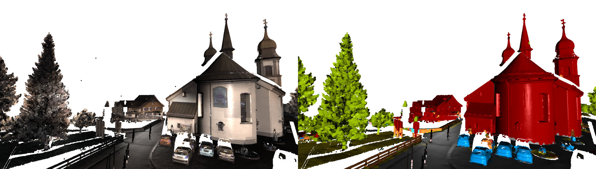

# Tangent Convolutions for Dense Prediction in 3D

This is a Tensorflow implementation of ["Tangent Convolutions for Dense Prediction in 3D"](http://vladlen.info/publications/tangent-convolutions-dense-prediction-3d/) by Maxim Tatarchenko*, Jaesik Park*, Vladlen Koltun and Qian-Yi Zhou, CVPR 2018.

## Setup

Pre-prequisites

	python == 3.6
	tensorflow >= 1.3
	joblib
	
Clone [this version of Open3D](https://github.com/tatarchm/Open3D.git). Install dependencies and compile it by running
	
	$ cd Open3D
	$ util/scripts/install-deps-ubuntu.sh
	$ mkdir build
	$ cd build
	$ cmake ../src
	$ make

Note that we only tested the system on Ubuntu Linux >= 16.04.
Update the path to Open3D and the path to Tangent Convolutions in

	tangent_convolutions/util/path_config.py

## Experiments

Experimental parameters are stored in .json configuration files. You can find configurations for all experiments shown in the paper in the 'experiments' folder. The exact description of individual parameters is provided [here](util/README.md).

## Initial Data Preparation

We provide the 'get_data.py' script for initial data downloading, extraction and conversion. It supports three datasets: S3DIS, ScanNet and Semantic3D. Below we describe how to use this script to prepare each of those datasets. Upon completion, it produces a set of directories, each one containing data for a single scan ('scan.pcd' and 'scan.labels').

### S3DIS

[Download](http://buildingparser.stanford.edu/dataset.html#Download) the aligned version of the dataset. Now you should have a file called 'Stanford3dDataset_v1.2_Aligned_Version.zip'. Run

	$ python get_data.py <directory_where_zip_is> <desired_output_directory> stanford

### ScanNet

[Get access](https://github.com/ScanNet/ScanNet) to the ScanNet dataset. Download all require data types by executing

	$ python download-scannet.py -o ScanNet --task_data --type .aggregation.json _vh_clean_2.0.010000.segs.json _vh_clean_2.ply

This should produce a directory with a bunch of subdirectories named 'scenexxxx_xx' in it. Now, run

	$ python get_data.py <directory_with_scans> <desired_output_directory> scannet
	
### Semantic3D

Run

	$ python get_data.py <directory_for_downloaded_files> <desired_output_directory> semantic3d

## Precomputation

In order to precompute the parametrization for a dataset, run

	$ python tc.py <experiment_config> --precompute

## Training and testing

To start network training, run

	$ python tc.py <experiment_config> --train

During training, the network outputs intermediate data into these folders:

- ``logs``: Training logs which can be visualized using Tensorboard.
- ``snapshots``: Network snapshots which are saved based on the evaluation performance. If current evaluation is the best so far, the corresponding snapshot is saved.

To test a trained model, run

	$ python tc.py <experiment_config> --test

This process outputs predictions for the test set into the ``outputs`` folder. These predictions are on low-resolution point clouds. If you want to generate predictions for raw high-resolution data which was used for precomputation, run

	$ python tc.py <experiment_config> --extrapolate

This script generates a final prediction file named as specified in the ``output_file`` parameter and puts it into the corresponding folder containing the low-resolution predicitons. To evaluate the quality of the high-resolution predictions, run

	$ python tc.py <experiment_config> --evaluate

## Visualization

To visualize predictions, run

	$ python vis.py <experiment_config> <scan_name> <mode>

\<mode\> can be one of ``g`` (show ground truth labels), ``p`` (show predicted labels) or ``c`` (show colors).

By default, downsampled scans are visualized. If you want to instead visualize the original scans, add the '--raw' flag.

## Training on your data

If you want to train the network on your own dataset, you need to prepare the data.

Your data should be converted into the following structure:

	<scan_name1>
	...scan.pcd
	...scan.labels
	<scan_name2>
	...scan.pcd
	...scan.labels
	...

where scan.pcd contains 3D points with their attributes (colors, intensities etc.) and scan.labels is a text file with per-point semantic labels (0 corresponds to unlabeled data, 1-N to the actuall class labels).

Then, you need to specify a configuration file for the experiment. See example in

	tangent_conv/experiments/stanford/dhnrgb/config.json

You also need to provide a train/test split for you data (.txt files containing the corresponding <scan_name> in each line).

Finally, you need to add a new class with your dataset parameters into

	tangent_conv/util/dataset_params.py

From here on, you can follow the standard procedure for pre-computation and training/testing as described before.

## Citation

If you use our code for research, please cite our paper:

Maxim Tatarchenko*, Jaesik Park*, Vladlen Koltun and Qian-Yi Zhou. Tangent Convolutions for Dense Prediction in 3D. In CVPR 2018.

## License

MIT License.
